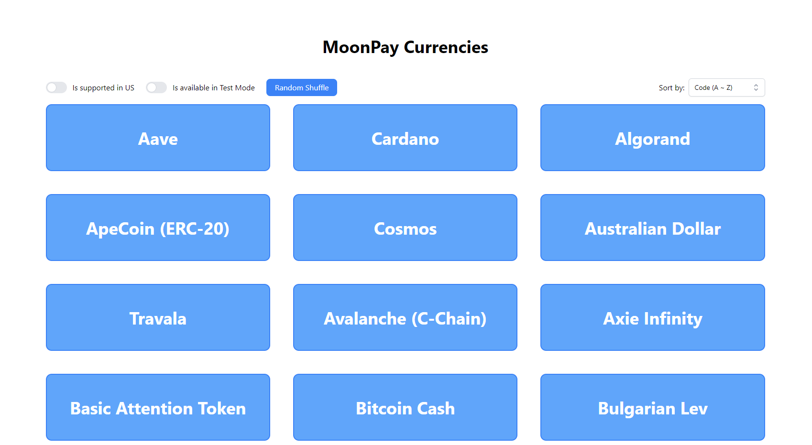

<div align="center">
  <p>
    
  </p>
  <p>
    The new standard for fiat to crypto
  </p>
</div>

# Take Home Test (Backend & Frontend)

## Overview

This is a takehome test for candidates applying for a full-stack developer
position at MoonPay. It contains three sections: "Frontend", "Backend" and "Follow-up" which
together include a series of tests involving JavaScript, React, Node.js, HTML and CSS.

## Frontend


For the frontend portion of the test, use the `/frontend` folder. There are 7 features we'd like to add:

1. Fetch and display the list of currencies available on MoonPay (see endpoint below).
2. Add a responsive functionality for the layout, which will display one column on mobile
   devices, two columns on tablet devices, and three columns on desktops.

3. Add a toggle to control if currencies not supported in the US should be displayed.
4. Add a toggle to control if currencies not available in test mode should be displayed.
   1. We expect that filters from points 3. and 4. can be combined together.
5. Add a button to sort the list of currencies by alphabetical order using the name of the currencies.
6. Add a button to sort the list of currencies by alphabetical order using the symbol/code of the currencies.
7. Add a button to apply a random shuffle to the list of currencies when it is clicked.

NOTE: Please make the app be served on port `:3000`.

Feel free to structure the code however you prefer and use third-party libraries at your discretion.

Do not spend too much time on making it beautiful. Basic aesthetics are welcome, but we are not
grading your design skills here.

### API Information

- **MoonPay API `GET /v3/currencies` endpoint:** https://api.moonpay.com/v3/currencies

## Backend

For the backend portion of the test, use the `/backend` folder. We'd like to write some code that achieves the following:

1. Create a JSON API (REST or GraphQL) using Node.js which will return which cryptocurrency exchange we should use to buy a given amount of Bitcoin to minimize the amount of USD or USDT we'll spend on this trade.

Example API call (for 1 BTC):

```
curl http://localhost:4000/exchange-routing?amount=1
```

Example API response (if Coinbase price of \$10,000 / BTC is the cheapest):

```
{
  "btcAmount": 1,
  "usdAmount": 10000,
  "exchange": "coinbase"
}
```

2. You'll need to compare Binance and Coinbase [order books](https://www.investopedia.com/terms/o/order-book.asp) and compute the best execution price for the given amount of Bitcoin we want to buy. (You can assume that 1 USDT = 1 USD at all time.)
3. [Bonus] Add a third exchange to compare with Binance and Coinbase.

Feel free to structure the code however you prefer and use third-party libraries at your discretion.

NOTE: Please make the server listen on port `:4000`.

### API Information & Documentation

- **[Crypto Trading 101: How to Read an Exchange Order Book](https://www.coindesk.com/crypto-trading-101-how-to-read-an-exchange-order-book)**
- **[Binance Order Book API Endpoint](https://github.com/binance/binance-spot-api-docs/blob/master/rest-api.md#order-book)**
- **[Coinbase Order Book API Endpoint](https://docs.cloud.coinbase.com/exchange/reference/exchangerestapi_getproductbook)**

_Note that both APIs above are public and don't require any authentication._